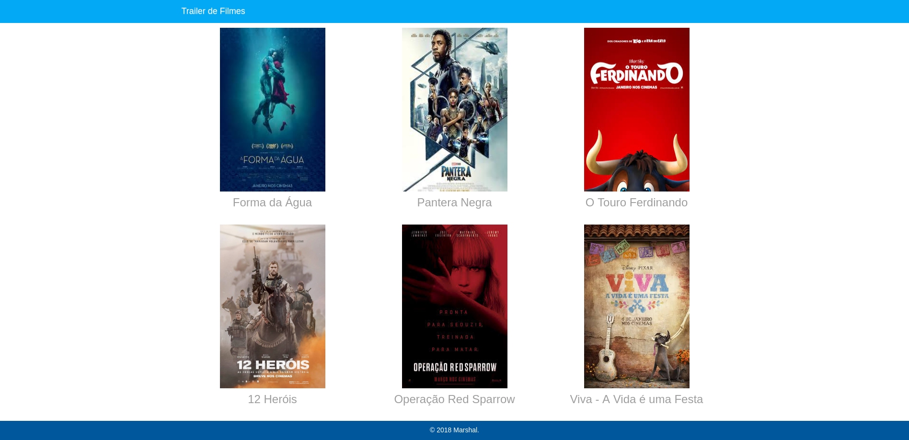
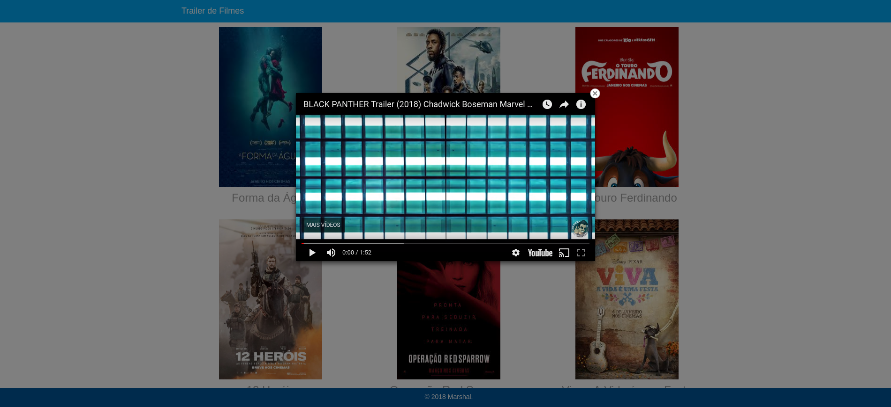

# Movie Trailer Site
Movie Trailer Site is an application that show trailers. Clicking over the poster image and watch trailer film that your selected.

## Installation
Abaixo segue os passos das instalações necessárias:

1. Instalar o Python 3 - acesse este [link](https://www.python.org/downloads/) e faça o download e instalação do Python 3 de acordo com seu sistema operacional.
2. Baixar o projeto - baixe este projeto na sua máquina em um local de sua preferência.
3. Acessar a pasta `movie_trailer`.

    * `$ cd movie_trailer` para Mac e Linux.
4. Executar o comando(no Shell):

    * `$ python entertainment.py`

Após os passos acima, será aberta uma página em seu navegador web conforme a figura abaixo:

## Usage
Clique sobre o cartaz do filme que deseja e em seguida será aberto um popup com o trailer do filme confome a imagem a seguir:

## License
Movie Trailer Site is released under the [MIT
license](https://github.com/atom-community/markdown-preview-plus/blob/master/LICENSE.md).
